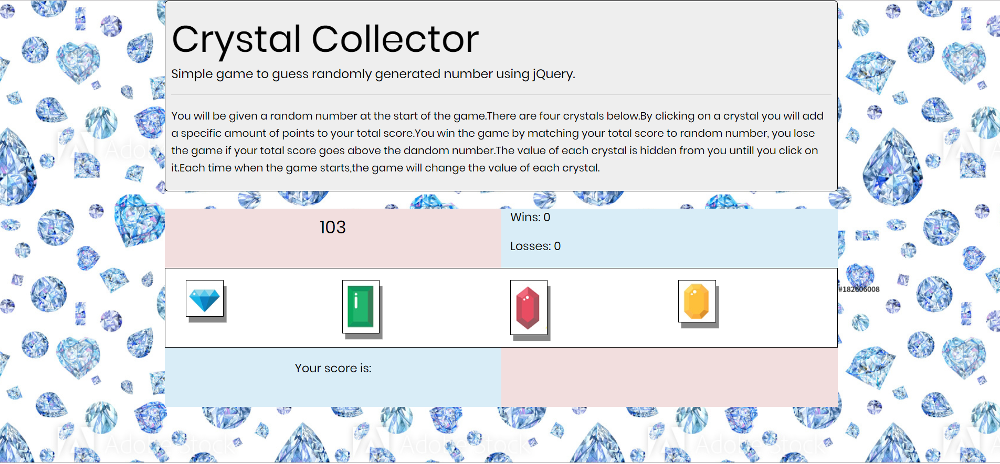

# Crystal Collector Game!

##### This is a bootcamp homework project. A fun number guessing game.
##### This is front-end application that uses HTML,CSS,JavaScript and jQuery.

## How to play
##### You will be given a random number at the start of the game. Use the crystals to match your points to the random number. The value of the crystals changes for every game and you must figure out their values on your own.
##### Match your points to the random number to win. If you go over, you lose!

[Click here to play game](https://pshegde123.github.io/unit-4-game.github.io/)

##### Technology: HTML5 | CSS3 | JavaScript | jQuery | Bootstrap
